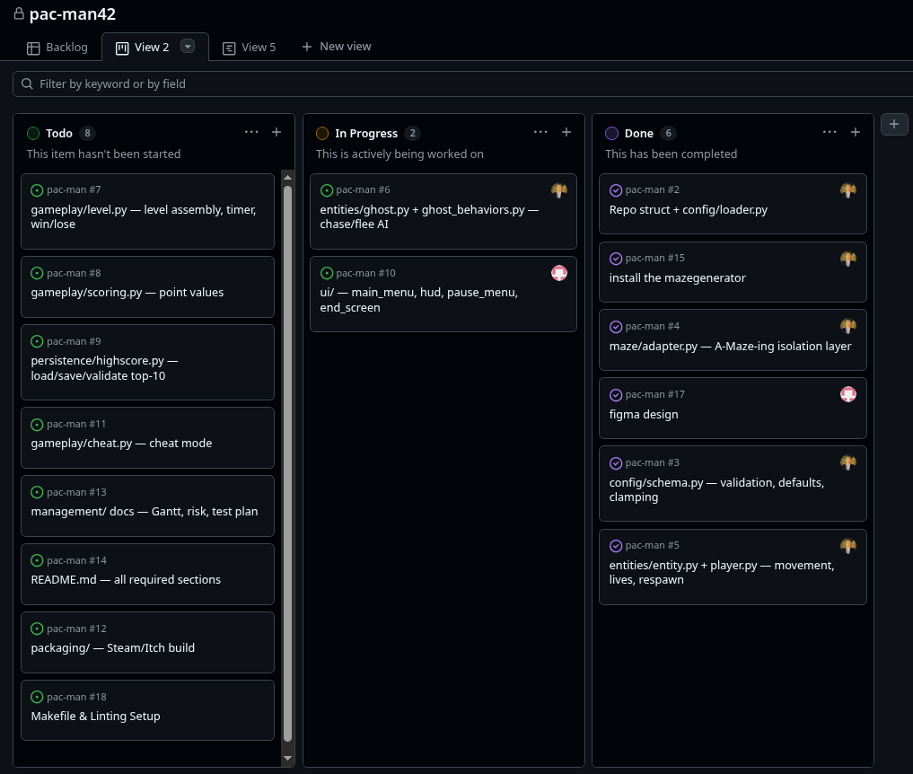
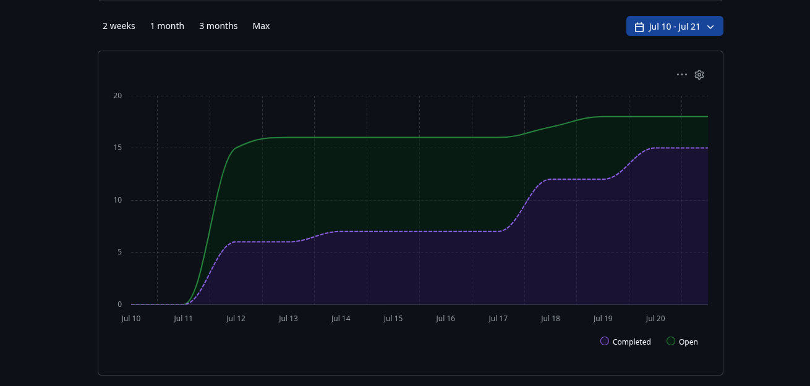

# Progress Tracking

Final snapshot as of project completion (July 20th). 

## Status vs. Plan

| Milestone | Planned | Notes |
|---|---|---|
| M1: Foundations | Config, Maze Adapter | Completed on schedule. |
| M2: Full loop | Entities, Level, Game, UI | Game fully playable end-to-end. |
| M3: Polish | Cheats, Linting, Packaging | `mypy --strict` passed. Itch.io packaging complete. |
| Docs | README, Management | All required sections filled. |

## Deviations from Original Plan

- **Ghost AI and Level Assembly grouped together:** Rather than doing them in strict issue-number order, `ghost_behaviors.py` and `level.py` were developed simultaneously. `ghost_behaviors.py` needed a real maze/player position to test chase logic, and `level.py` needed ghosts to place in the level.
- **Packaging platform changed to Itch.io:** Initially assumed Steam, but switched to Itch.io after checking Steam's actual requirements (a $100 fee, a 30-day wait, native executable requirement) which are incompatible with a free, deadline-bound school submission.
- **Cheat mode simplified:** All cheats (Invincibility, Ghost Freeze, Speed Boost, Timer Freeze) were mapped to a single `F1` toggle to make peer-review testing as fast as possible.

## Blocking Points & Resolutions

No team/schedule risks occurred. All technical blocking points were caught during code review before merging:
- **Maze "42" shape collision:** The `mazegenerator` carves a "42" in the center. Initially, the player spawned inside the walls of the '4' or '2'. Resolved by calculating the exact gap between the numbers and hardcoding that as the spawn point.
- **Movement momentum loss:** Early movement logic caused the player to stop if they pressed a direction blocked by a wall. Resolved by buffering the next direction and falling back to the current direction if the new one is blocked (smooth wall sliding).
- **Pygame type hinting:** `mypy --strict` flagged Pygame's C-extension types. Resolved by configuring `mypy` to ignore missing imports for third-party C-extensions.

# Kanban Board View:

# Task Graph View:
