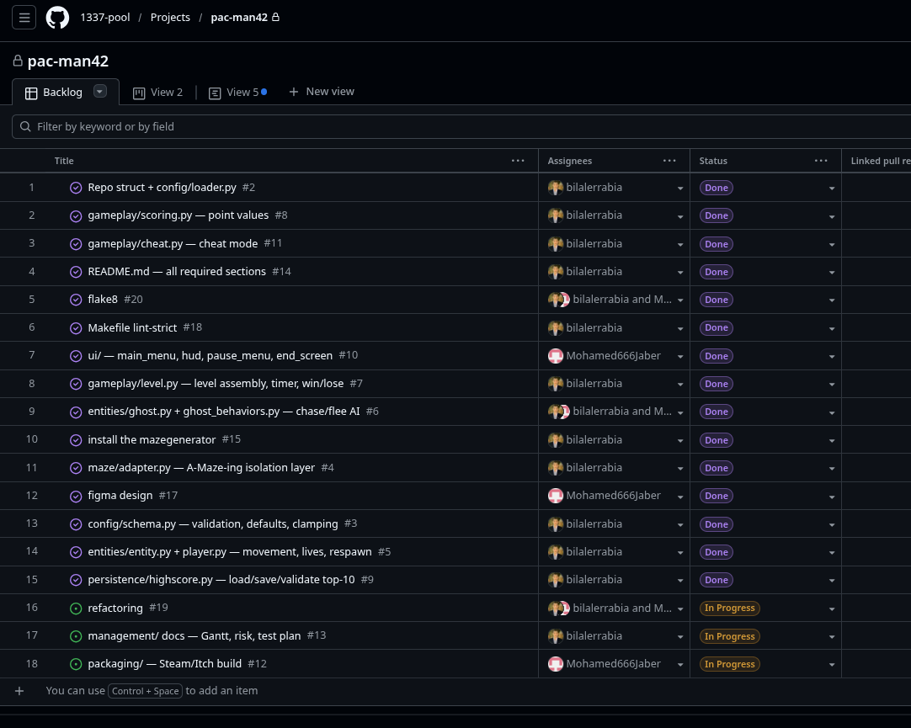

# Team Organization

## Team Members
- **berrabia** (Backend / Logic / Project Management)
- **mjaber** (Frontend / UI / Design / Main Loop)

## Communication & Workflow
- **Tools:** GitHub Projects (Kanban board, issues, milestones) and Discord (daily communication, planning, and pair debugging).
- **Methodology:** Agile-inspired. The project was broken into 18 concrete issues mapped to 3 milestones.

## Task Distribution

The project was divided using a strict backend/frontend boundary to allow parallel development without constant merge conflicts.

### berrabia (Backend & Logic)
- **Configuration:** `config/loader.py` (JSON + comment parsing), `config/schema.py` (validation, defaults, clamping).
- **Maze:** `maze/adapter.py` (bitmask decoding, spawn point calculation).
- **Gameplay:** `gameplay/level.py` (collisions, pacgums), `gameplay/game.py` (state machine, timer), `gameplay/cheat.py`.
- **Entities:** `entity.py` (smooth movement), `player.py`, `ghost.py`, `ghost_behaviors.py` (BFS pathfinding).
- **Persistence & Tooling:** `highscore.py`, `Makefile`, `mypy`/`flake8` compliance, Itch.io packaging.

### mjaber (Frontend & UI)
- **Design:** Figma mockups for menus, HUD, and visual direction.
- **UI Implementation:** `ui/theme.py`, `ui/button.py`, `ui/maze_renderer.py`.
- **Screens:** `ui/home_screen.py`, `ui/highscore_screen.py`, `ui/instructions_screen.py`.

## Project Backlog & Assignees:
