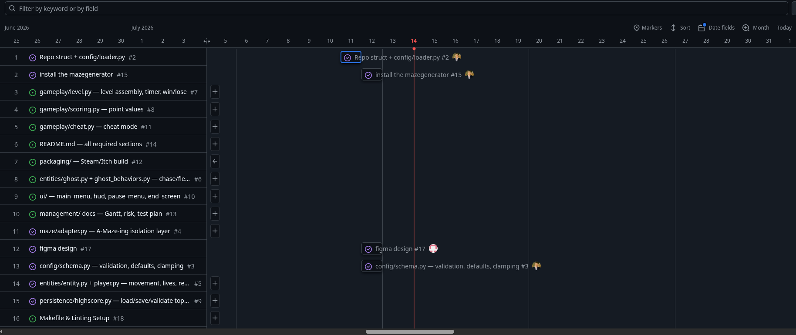

# Project Timeline

We track work with a GitHub Projects board (3 columns: Todo / In Progress /
Done), organized into three milestones that map to the project's natural
build order:

- **M1: Foundations** — repo scaffold, config system, maze adapter, base
  entities. Nothing here depends on anything else; everything after depends
  on this.
- **M2: Full loop** — ghost AI, level assembly, scoring, highscore
  persistence, full UI. This is where the actual game becomes playable.
- **M3: Polish** — cheat mode, packaging/deployment, documentation.

## Board view

As of this screenshot: 6 issues Done, 2 In Progress (ghost behaviors AI,
UI screens), 8 in Todo.

## Gantt / timeline view

Issues are laid out against the calendar to visualize sequencing and overlap.
Foundational issues (#2 scaffold, #3 config schema, #4 maze adapter, #5
entities) were completed first and in parallel with early design decisions
(e.g. inspecting the assigned `mazegenerator` package's interface before
writing the adapter, so the adapter wasn't designed blind).

## Milestones and target order

| Milestone | Issues | Depends on |
|---|---|---|
| M1: Foundations | #2, #3, #4, #5 | — |
| M2: Full loop | #6, #7, #8, #9, #10 (UI portion) | M1 |
| M3: Polish | #11 (cheat), #12 (packaging) | M2 |
| Docs (ongoing) | #13, #14 | can start early, finalized last |

`#12` (packaging) is intentionally last on the board: it cannot start until
the full game runs end-to-end, since there is nothing to package before then.

## Team split

- **berrabia**: config system, maze adapter, entities (player/ghost),
  highscore persistence, project management (board, milestones, this
  documentation).
- **mjaber**: Figma design, UI implementation (main menu, HUD, pause menu,
  end screens).
