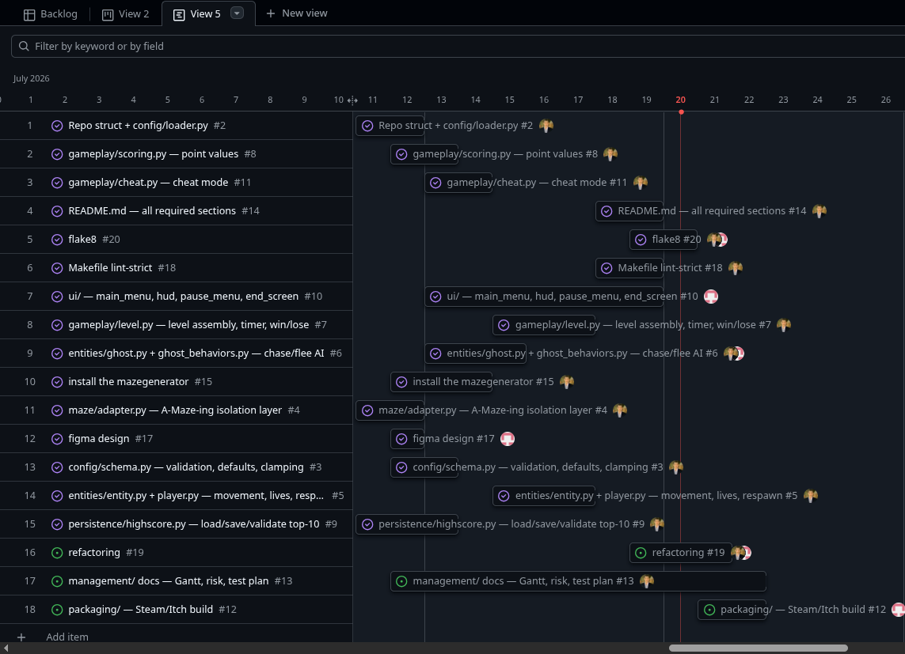

# Project Timeline

**Start Date:** July 07th
**End Date:** July 20th
**Total Duration:** 13 Days

The project was managed using a GitHub Projects Kanban board with milestones mapped to a 13-day schedule. Communication and daily planning were handled via Discord.

## Milestone Schedule

### M1: Foundations (July 07th - July 13th)
* **Focus:** Repository structure, configuration system, and maze integration.
* **Tasks Completed:** Repo setup, `config/loader.py` (JSON+comments), `config/schema.py` (validation/clamping), `maze/adapter.py` (bitmask decoding).
* **Note:** Took slightly longer than expected to reverse-engineer the external `mazegenerator` package's bitmask encoding by reading its source directly.

### M2: Full Loop (July 14th - July 17th)
* **Focus:** Core gameplay, entities, and UI integration.
* **Tasks Completed:** `entity.py` (smooth movement), `player.py`, `ghost.py`, `ghost_behaviors.py` (BFS AI), `level.py` (collisions/pacgums), and `game.py` (state machine). UI screens developed in parallel.
* **Note:** Ghost AI and Level assembly were grouped together to allow testing against real maze data rather than mocks.

### M3: Polish & Docs (July 18th - July 20th)
* **Focus:** Cheat mode, strict linting, packaging, and documentation.
* **Tasks Completed:** `cheat.py` (F1 toggle), `Makefile` finalization, `mypy --strict` compliance, Itch.io packaging script, `README.md`, and management docs.

## Gantt View Summary
